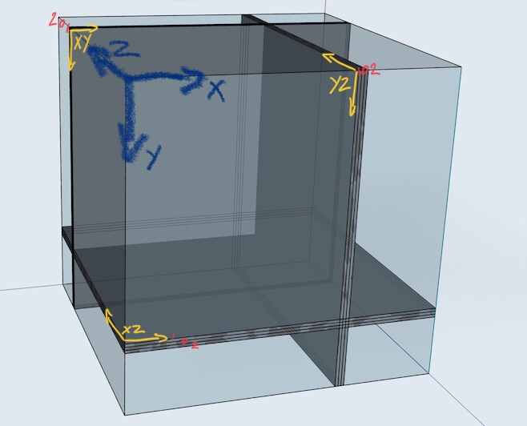

# Turbulent Dynamics QVec Library


## Getting Started
```
git clone --recursive https://github.com/TurbulentDynamics/tdQVecTool.git
cd tdQVecTool && swift build
./tdQVecTool -va Tests/TinyTestData
./tdQVecTool -v TD_Rushton_Sample_Output_QVec/plot_slice.XZplane.V_4.Q_4.step_00000200.cut_70
./tdQVecTool *

There is limit to number of arguments on Linux systems so the following can also be used
./tdQVecTool -a /path/to/rootdir
./tdQVecTool --blob "rootdir/*.XZplane*"
./tdQVecTool --xzplane rootdir


#The jupyter notebook in the "python" directory can be used to visualise the file created.
```


## Directory naming convention
All the files for one output are contained in a single directory with a naming convention expaining the type of files contained inside.

### plot_full.volume.V_4.Q_[length of vectors].step_[step num]
This contains 3D data and is the largest amount of data, sometimes as large as 400GB of data over all files. The data format holds x, y, z coordinate and the number of vectors.


<!--### plot_full.volume_dense-->
<!--This will contain the above but without the co-ordinate data-->


### plot_slice.[XYplane|XZplane|YZplane].V_4.Q_[length of vectors].step_[step num].cut_[plane coord]
These directories contain 2D data, a slice or cut through the full volume.  The plane is always orthogaonal to one axis.


### plot_rotational_capture.rotational_capture.V_4.Q_4.step_00000050.angle_15.blade_id_0
These contain a 2D cut off axis but through a center axis


<!--### plot_skew.V_4.Q_4.step_00000050.angle_15.blade_id_0-->
<!--This is a cut but not orthogonal to any axis.-->


## File Types QVec and QVec.F3
QVec contains the vectors from Lattice Boltzmann cells, of length 5, 9, 19 or 27, and QVec.F3 always contains 3 "Forcing" vectors along the major axes.  Each .bin file has a corresponding .bin.json file containing metadata.

### File naming convention
Qvec.node.X.Y.Z.V4.bin or Qvec.F3.node.X.Y.Z.V4.bin
node.X.Y.Z is the output from the node with cartesian coordinates X, Y, Z
V4: Version 4
The length of vectors is found from either the bin.json or the directory name.


## Axes and XYZ Output Planes
The axes and direction are defined with X positive to the right, Y positive downwards and Z positive to the back.  The following image shows the axes and the name of the output planes that cut throught the simulation space.



